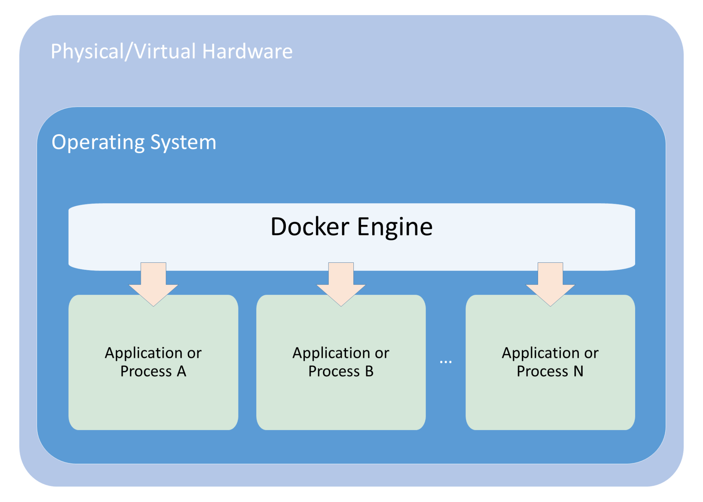
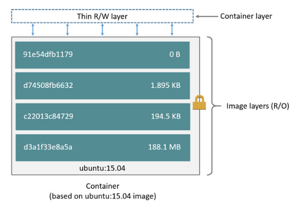
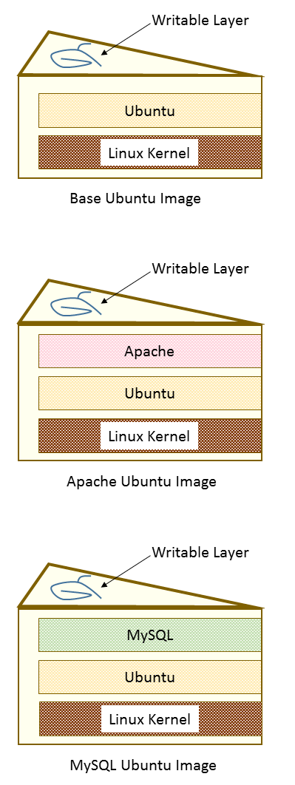

## Definición

Docker es una plataforma para desarrolladores y administradores de sistema para construir, lanzar y ejecutar aplicaciones dentro de contenedores.

> Nuestro software no debería ejecutar de manera aleatoria

## Introducción a los Contenedores

Aunque parezca increible, los contenedores y sus precursores llevan por aquí más de 15 años, en los sistemas operativos de Linux y Unix. Desde comienzos del 2000, ha habido intentos para encapsular la tecnología de contenedores para el usuario final:

* FreeBSD
* Linux
* Solaris
* Open VZ
* Warden
* Docker

En el año 2013, es cuando Docker da un vuelco al mercado haciendo que los contenedores sean adoptados de manera masiva, el secreto, hacer fácil el uso de contenedores para el usuario final. A día de hoy los contenedores ejecutan cualquier tipo de aplicación que nos podamos imaginar:

* IoT
* Banking workloads
* Tradding

> As Malcom McLean revolutionized the physical shipping world in the 1950s by creating a standardized shipping container, which is used today for everything from ice cube trays to automobiles, Linux containers are revolutionizing the software development world by making application environments portable and consistent across the infrastructure landscape.

## ¿Qué es un contenedor?

La encapsulación, del paradigma del conetenedor, que realiza Docker representa una implementación moderna del aislamiento de recursos que utiliza características del Kernel de Linux, tales como chroot, **control groups (cgroups)**, UninonFS y namespaces para aislar completamente el control del recurso a nivel de proceso.

Los contenedores usan las tecnologías anteriormente citadas para crear imágenes ligeras, que actúan de manera independiente, encapsualndo completamente un trozo de software que lleva todo lo que necesita dentro de su propia caja. Esto puede incluir los binarios de una aplicación, cualquier herramienta del sistema o librerías, configuración basada en el entorno de ejecución, y las intrucciones necesarias para su ejecución. 

Esta propiedad tan importante, que es el aislamiento, permite a los desarrolladores y operadores, liberar la naturaleza de todo en uno de los contenedores para ejecutar sin problemas, sin importar el entorno en el que se están ejecutando. Esto incluye desde mi máquina hasta cualquier servidor de producción.

Este desacoplamineto de empaquetado de aplicaión del entorno en el cuál se va a ejecutar es un concepto poderoso que provee una clara separación de responsabilidades. Permite a los desarrolladores centrarse en construir la aplicación del código y gestionar sus propias dependencias, mientras que los operadores pueden delimitar la integración continua, y despliegue sin tenerse que preocupar  por su configuración.

* En el corazón de la tecnología de contenedores existen 3 piezas clave:
    - cgroups
    - Namespaces
    - Union filesystems

### cgroups

Los `cgroups` trabajan permitiendo al `host` compartir y limitar los recursos a cada proceso o contenedor que puedan consumir. Muchos contenedores pueden compartir CPU y memoria mientras que se mantengan en las restricciones predefinidas. Los `cgroups` permiten a los contenedores provisionar acceso a memoria, acceso a disco I/O, red, y CPU. Se puede incluso acceder a dispostivos. 

* Los `cgroups` más relevantes:
    - **Memory cgroup**: This keeps track of page access by the group, and can define limits for physical, kernel, and total memory.
    
    - **Blkio cgroup**: This tracks the I/O usage per group, across the read and write activity per block device. You can throttle by group per device, on operations versus bytes, and for reads versus writes.
    
    - **CPU cgroup**: This keeps track of user and system CPU time and usage per CPU. This allows you to set weights, but not limits.
    
    - **Freezer cgroup**: This is useful in batch management systems that are often stopping and starting tasks in order to schedule resources efficiently. The SIGSTOP signal is used to suspend a process, and the process is generally unaware that it is being suspended (or resumed, for that matter.)
    
    - **CPUset cgroup**: This allows you to pin a group to a specific CPU within a multi-core CPU architecture. You can pin by application, which will prevent it from moving between CPUs. This can improve the performance of your code by increasing the amount of local memory access or minimizing thread switching.
    
    - **Net_cls/net_prio cgroup**: This keeps tabs on the egress traffic class (net_cls)  or priority (net_prio) that is generated by the processes within the cgroup.
    
    - **Devices cgroup**: This controls what read/write permissions the group has on device nodes.

### Namespaces

Los `namespaces` ofrecen una nueva forma de aislamiento para al interacción del proceso con los sistemas operativos, creando el `workspace` llamamos a un contenedor. `Linux namespaces` son creados via una `syscall` llamada _unshare_, mientras que _clone_ y _setns_ permite manipular los `namespaces` de otras maneras.

> *unshare()* allows a process (or thread) to disassociate parts of its execution context that are currently being shared with other processes (or threads). Part of the execution context, such as the mount namespace, is shared implicitly when a new process is created using FORK(2) (for more information visit http://man7.org/linux/man-pages/man2/fork.2.html) or VFORK(2) (for more information visit http://man7.org/linux/man-pages/man2/vfork.2.html), while other parts, such as virtual memory, may be shared by explicit request when creating a process or thread using CLONE(2) (for more information visit http://man7.org/linux/man-pages/man2/clone.2.html).

Los `namespaces` limitan la visibilidad que un proceso tiene en otros procesos, `networking`, `filesystems`, y componentes del `user ID`. Los procesos de contenedores están limitados para ver sólo lo que está en el mismo `namespace`. Los procesos desde los contenedores o los procesos del `host` no son directamente accesibles desde dentro de los procesos del contenedor. Adicionalmente Docker, proporciona a cada contenedor su propia `networking` que protege a los `sockets` y las `interfaces` de una manera similar.

Si los `cgroups` limitan cuanto puedes usar de algo, los `namespaces` limitan cuanto puedes ver de algo.



* En el caso de Docker los siguientes `namespaces` son usados:
    - _pid_: Provides process isolation via an independent set of process IDs from other namespaces. These are nested.
    - _net_: Manages network interfaces by virtualizing the network stack through providing a loopback interface, and can create physical and virtual network interfaces that exist in a single namespace at a time.
    - _ipc_: Manages access to interprocess communication.
    - _mnt_: Controls filesystem mount points. These were the first kind of namespaces created in the Linux kernel, and can be private or shared.
    - _uts_: The Unix time-sharing system isolates version IDs and kernel by allowing a single system to provide different host and domain naming schemes to different processes. The processes gethostname and sethostname use this namespace.
    - _user_: This namespace allows you to map UID/GID from container to host, and prevents the need for extra configuration in the container.

### Union filesystems

Los `union filesystems` son otra ventaja clara de usar contenedores de Docker. Los contenedores corren desde una imagen, está representa un punto en el tiempo. Las imágenes de los contenedores realizan un `snapshot` del `filesystem`, pero tienden a ser mucho más pequeño que el de una `VM`. El contenedor comparte el `kernel host` y generalmente ejecuta un conjunto mucho menor de procesos, así que el `filesystem` y el período de `bootstrap` tiende a ser mucho menor. Segundo, la `union filesystem` permite un almacenimiento eficiente, descarga, y ejecución de estas imágenes. Los contenedores usan la idea de _copy-on-write storage_, que es capaz de crear otro contenedor inmediatamente, sin tener que esperar a copiar todo el `filesystem`



`Copy-on-write storage`, sigue la pista de lo que ha cambiado, y en este sentido es similar a los sistemas de control distribuido como Git. Las opciones que tenemos disponibles para `copy-on-write storage`: 

* AUFS and overlay at the file level
* Device mapper at the block level
* BTRFS and ZFS and the filesystem level

La manera más sencilla de comprender los `union filesytems` es pensar en ellos como en capas de una tarta, con cada capa cocinada de manera independiente. El `linux kernel` es nuestra capa base; luego puede haber un sistema operativo como RedHat o Ubuntu.

Después podemos añadir una aplicación como `nginx` o `Apache`. Cada cambio genera una capa nueva. Finalmente, a medida que vas añadiendo cambios y nuevas capas son añadidas, siempre tienes un última capa, que es la capa sobre la que se puede escribir. `Union filesystems` proveen esta estrategia para hacer cada capa ligera y veloz.

En el caso de Docker, es el `storage driver` el responsable de apilar estas capas una sobre otra dando una única interfaz para estos sistemas. La última capa sobre la que se puede escribir es donde realizaremos nuestro trabajo.



Lo que hace esto realmente eficiente es que Docker cachea las capas la primera vez que construimos una imagen. Digamos que tenemos una imagen con Ubuntu y después le añadimos Apache y construimos la imagen. Después, construimos MySQL con Ubuntu de base. La segunda `build` será mucho mñas rápida porqué la capa de Ubuntu está en cache.

## Containers Summary

Los contenedores son un mecanismo de empaquetado lógico, en los cuales las aplicaciones son ejecutadas de forma aislada (ficheros, network y memoria) del resto usando características provistas por el Kernel de Linux: 

* __namespaces__: Limitan los recursos del kernel de Linux que son vistos por un proceso.
* __cgroups__: Controlan los recursos asignados a un proceso.
* __Union filesystems__: Capas independientes que se pueden compartir.

## Container vs Virtual Machine

> ¿Cuál es la principal diferencia entre contenedores y VM? Kernel

## Container Run-Times

* docker
* rkt
* cri-o
* containerd
* runc
* lxc

## Docker Architecture

Tres actores principales, `client`, `docker_host` y `registry`. El cliente se comunica via REST API con el servidor dentro del `docker_host`. Las imágenes (plantillas para nestros contenedores), son recuperadas desde un repositorio de imágenes un `registry`.

## Docker Daemon

* manages network
* manages image
* manages container
* manages data volumes

## Docker CLI

Docker tiene un `command line client` el cuál será nuestra interaz desde la creación de imágenes a la ejecución de contenedores.

```bash
$ docker help
```

## Immutability and Stateless Applications

Todo contenedor será creado desde una imagen indicada.

> New Change -> New Image

## Referencias

> Getting Started with Kubernetes - Thir Edition Jonathan Baier, Jesse White.
> Docker official docs: https://docs.docker.com/get-started/overview/