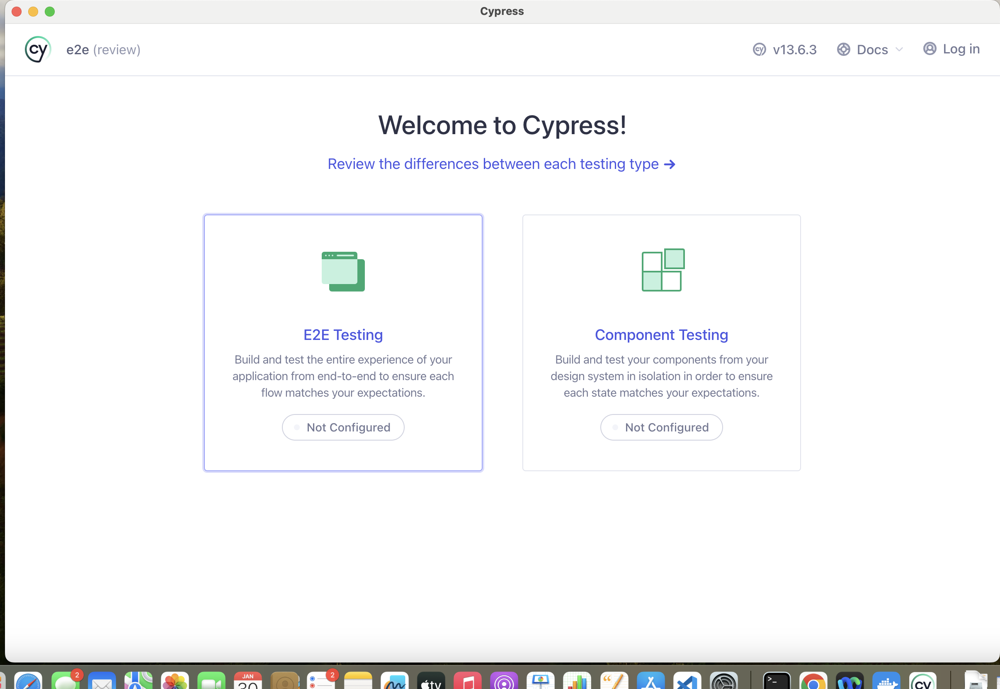
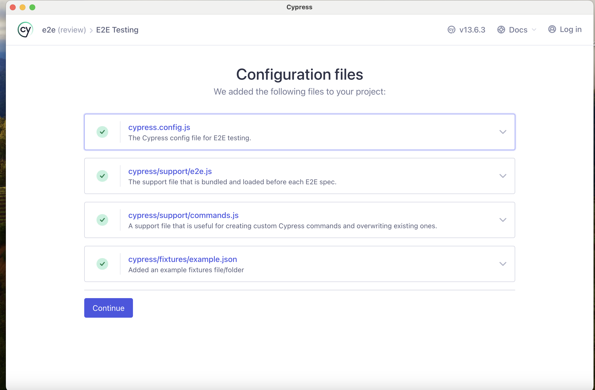
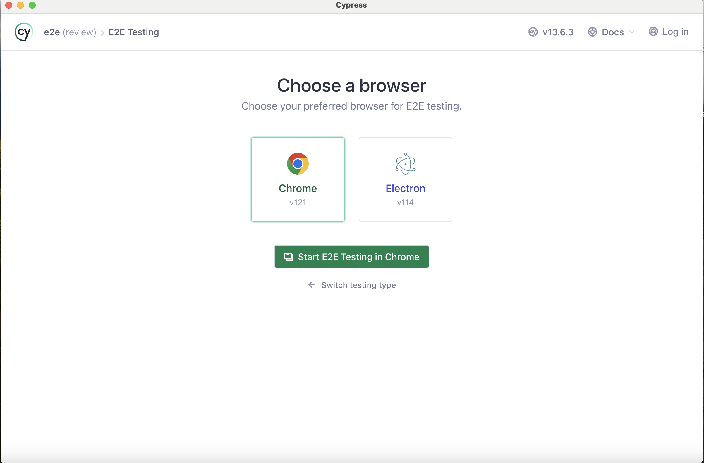
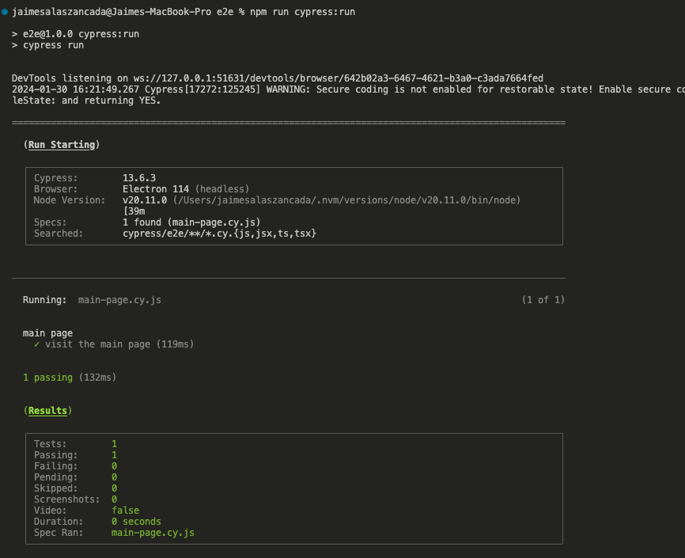

# Running Cypress

## Adding a basic script

Let's create a simple test with `cypress`, the better way to make this is allow `cypress` to build the scaffolding for us:

```bash
npx cypress open
```







Create a new file `./e2e/cypress/e2e/main-page.cy.js`

```js
/// <reference types="Cypress" />

describe("main page", () => {
  it("visit the main page", () => {
    cy.visit("/");
    cy.get("body").contains("average score");
  });
});
```

In order to make that cypress can reach our application, we must update `./e2e/cypress.config.js`

```javascript
const { defineConfig } = require("cypress");

module.exports = defineConfig({
  e2e: {
    setupNodeEvents(on, config) {
      // implement node event listeners here
    },
    baseUrl: "http://localhost:8081",
  },
});
```

## Running the script

Instead of opening cypress from the terminal, we're going to modify the `package.json`, and then run as a `npm` command.

Update `./e2e/package.json`

```diff
# package.json
# ....
"scripts": {
+ "cypress:open": "cypress open",
  "test": "echo \"Error: no test specified\" && exit 1"
},
# ....
```

- To run our tests, we must open two terminals:
  1. From front directory: `npm start` -> starts our application on `localhost:8081`
  2. From  `npm run cypress:open` -> open cypress terminal
  3. Run our scripts from cypress terminal.

## Automating running Scripts

Right now we have our test that are running on the browser by `cypress`, but the problem with this approach is that must be raised by hand, and does not fit for `CI`. Let's add a new `npm` script that help us:


Update `e2e/package.json` as follows

```diff
# package.json
# ....
"scripts": {
+ "cypress:run": "cypress run",
  "cypress:open": "cypress open",
  "test": "echo \"Error: no test specified\" && exit 1"
},
# ....
```

Now we can run our tests in a CI way `npm run cypress:run`

