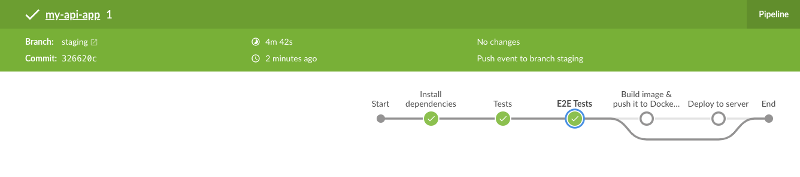

# 04 E2E tests

In this example we are going to create a new branch `staging` that will run E2E tests and update Jenkins pipeline to execute these test only on this branch.

We will start from `03-ec2-deployment`.

## Prerequisites

- Previous requirements from `03-ec2-deployment`.
- The app deployed to the EC2 instance.

## Steps to build it

We'll start by creating a new branch `staging` from `develop` branch.

```bash
git checkout develop
git checkout -b staging
```

Introduce a new environment variable to target the E2E tests.

_./src/envConstants.ts_

```diff
  export const envConstants = {
    PORT: process.env.PORT,
+   BASE_API_URL: process.env.BASE_API_URL,
  };
```

Add the new environment variable to `.env` and `.env.example` files:

```
PORT=3000
BASE_API_URL=http://localhost:3000
```

Create the file `./src/api.spec.ts` with next content:

_./src/api.spec.ts_

```javascript
import axios from 'axios';
import { envConstants } from './env.constants';

describe('api specs', () => {
  it('should return "The result is 5" when it feeds a equals 2 and b equals 3', async () => {
    // Arrange
    const a = 2;
    const b = 3;
    const url = `${envConstants.BASE_API_URL}/api/sum?a=${a}&b=${b}`;

    // Act
    const { data } = await axios.get(url);

    // Assert
    expect(data).toEqual('The result is 5');
  });
});
```

Let's create new commands to run these specs in `package.json`:

_./package.json_

```diff
    ...
    "scripts": {
      "start": "run-p -l type-check:watch start:dev",
      "start:dev": "nodemon --exec babel-node --extensions \".ts\" src/index.ts",
      "build": "run-p -l type-check build:prod",
      "build:prod": "npm run clean && babel src -d dist --ignore=\"./src/**/*.spec.ts\" --extensions \".ts\"",
      "type-check": "tsc --noEmit",
      "type-check:watch": "npm run type-check -- --watch",
      "clean": "rimraf dist",
-     "test": "jest --verbose"
+     "test": "jest --verbose math.helpers.spec",
+     "start:test:e2e": "npm start -- -r test:e2e",
+     "test:e2e": "jest --verbose api.spec"
    },
    ...
    "jest": {
      "preset": "ts-jest",
-     "restoreMocks": true
      "restoreMocks": true,
+     "setupFiles": [
+       "dotenv/config"
+     ]
    }
```

> More info about [`-r` flag](https://github.com/mysticatea/npm-run-all/blob/master/docs/npm-run-all.md#npm-run-all-command) to stop process when it finishes e2e tests
> We can change browser to another one, with headless version, see [commands](https://docs.cypress.io/guides/guides/command-line.html#Commands)

In order to make these tests pass we will need set up some environment variables, from project root run: `cp .env.example .env`

Let's try on locally.

```bash
npm run start:test:e2e
```

Now we can update the Jenkins pipeline to run these specs on `staging` branch:

_./Jenkinsfile_

```diff
  pipeline {
    agent any
    environment {
      imageName = 'myuser/my-api-app:latest'
+     ec2Instance = 'myec2-instance.compute.awscloud.com'
+     appPort = 80
    }
    stages {
      stage('Install dependencies') {
        agent {
          docker {
            image 'node:14-alpine'
            reuseNode true
          }
        }
        steps {
          sh 'npm ci'
        }
      }
      stage('Tests') {
        agent {
          docker {
            image 'node:14-alpine'
            reuseNode true
          }
        }
        steps {
          sh 'npm test'
        }
      }
+     stage('E2E Tests') {
+       when {
+         branch 'staging'
+       }
+       agent {
+         docker {
+           image 'node:14-alpine'
+           reuseNode true
+         }
+       }
+       environment {
+         BASE_API_URL = "http://$ec2Instance:$appPort"
+       }
+       steps {
+         sh 'npm run test:e2e'
+       }
+     }
      stage('Build image & push it to DockerHub') {
        when {
          branch 'develop'
        }
        steps {
          script {
            def dockerImage = docker.build(imageName)
            withDockerRegistry([credentialsId: 'dockerhub-credentials', url: '']) {
              dockerImage.push()
              sh 'docker rmi $imageName'
            }
          }
        }
      }
      stage('Deploy to server') {
        when {
          branch 'develop'
        }
        environment {
          containerName = 'my-api-app'
-         ec2Instance = 'myec2-instance.compute.awscloud.com'
-         appPort = 80
        }
        steps {
          withCredentials(
            sshUserPrivateKey(
              credentialsId: 'ec2-ssh-credentials',
              keyFileVariable: 'identityFile',
              passphraseVariable: 'passphrase',
              usernameVariable: 'user'
            )
          ) {
            script {
              sh '''
                ssh -o StrictHostKeyChecking=no -i $identityFile $user@$ec2Instance \
                APP_PORT=$appPort CONTAINER_NAME=$containerName IMAGE_NAME=$imageName bash < ./scripts/deploy.sh
              '''
            }
          }
        }
      }
    }
  }

```

Finally, let's commit and push the changes to GitHub.

```bash
git add .
git commit -m "Added E2E tests"
git push -u origin staging
```

We can see the pipeline succeeded after build.



We can now sync the `Jenkinsfile` with the other branches:

```bash
git checkout develop
git merge staging develop
git push
git checkout master
git merge staging master
git git push
```

# About Basefactor + Lemoncode

We are an innovating team of Javascript experts, passionate about turning your ideas into robust products.

[Basefactor, consultancy by Lemoncode](http://www.basefactor.com) provides consultancy and coaching services.

[Lemoncode](http://lemoncode.net/services/en/#en-home) provides training services.

For the LATAM/Spanish audience we are running an Online Front End Master degree, more info: http://lemoncode.net/master-frontend
