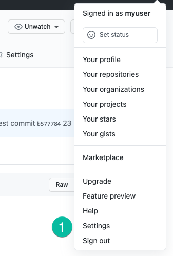
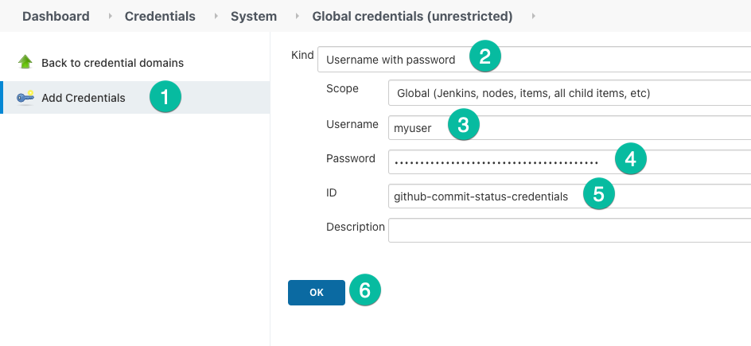
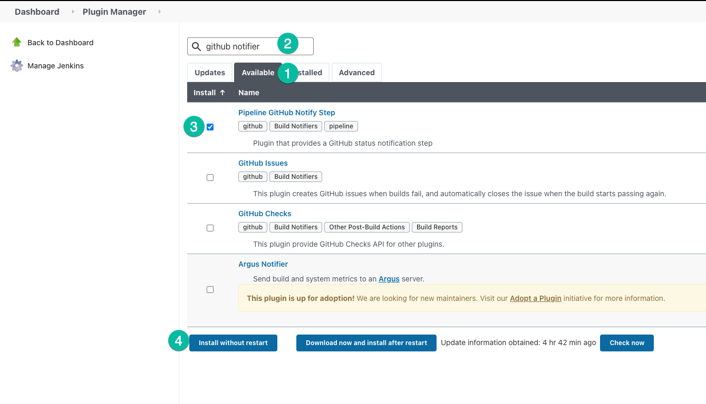
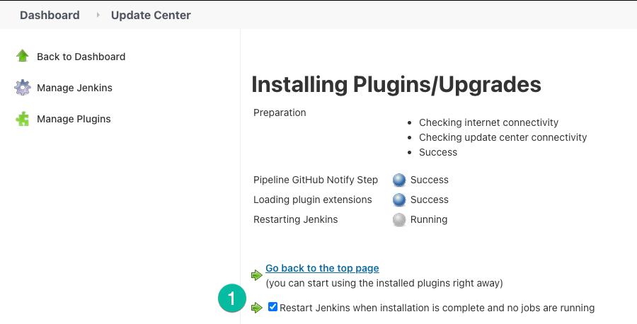
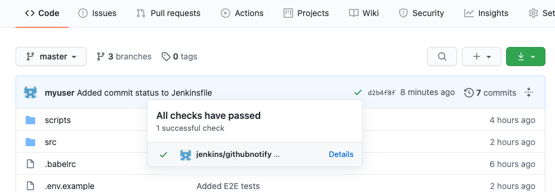

# 05 GitHub commit check

In this example we are going to enable Jenkins to access our GitHub repository in order to put the CI status on commits.

We will start from `04-e2e-tests`.

## Prerequisites

- Previous requirements from `04-e2e-tests`.

## Steps to build it

We'll need to create a new personal token in order to give Jenkins access to the repository. Click to your avatar in GitHub and go to `Settings`.



Once you're on the profile page click `Developer settings`.


Click `Personal access tokens` and then click `Generate new token`.


Give the token a descriptive name and next set of permissions and click `Generate token` button.


Once the token is created save the text for later. We'll create a `Jenkins` credentials to store it.


Now, from Jenkins, create a new credential by navigating to `Manage Jenkins → Manage Credentials → Stores scoped to Jenkins → global → Add Credentials`. We'll create a new `Username with password` credential matching our GitHub user and the GitHub token we created.



Next step is to install the [Pipeline GitHub Notify Step](https://plugins.jenkins.io/pipeline-githubnotify-step) plugin. Navigate to `Manage Jenkins → Manage Plugins → Available` and search for `Pipeline GitHub Notify Step` plugin.



Check `Restart Jenkins` after installation completes.



In our code, from `develop branch` we'll modify the `Jenkinsfile` to use the plugin.

```diff
  pipeline {
    agent any
    environment {
      imageName = 'myuser/my-api-app:latest'
      ec2Instance = 'myec2-instance.compute.awscloud.com'
      appPort = 80
+     githubAccount = "myuser"
+     githubRepoName = "my-api-app"
    }
    stages {
+     stage('Notify GitHub build in progress') {
+       steps {
+         githubNotify(
+           status: "PENDING",
+           credentialsId: "github-commit-status-credentials",
+           account: githubAccount,
+           repo: githubRepoName,
+           description: "Some checks haven't completed yet"
+         )
+       }
+     }
      stage('Install dependencies') {
        agent {
          docker {
            image 'node:14-alpine'
            reuseNode true
          }
        }
        steps {
          sh 'npm ci'
        }
      }
      stage('Tests') {
        agent {
          docker {
            image 'node:14-alpine'
            reuseNode true
          }
        }
        steps {
          sh 'npm test'
        }
      }
      stage('E2E Tests') {
        when {
          branch 'staging'
        }
        agent {
          docker {
            image 'node:14-alpine'
            reuseNode true
          }
        }
        environment {
          BASE_API_URL = "http://$ec2Instance:$appPort"
        }
        steps {
          sh 'npm run test:e2e'
        }
      }
      stage('Build image & push it to DockerHub') {
        when {
          branch 'develop'
        }
        steps {
          script {
            def dockerImage = docker.build(imageName)
            withDockerRegistry([credentialsId: 'dockerhub-credentials', url: '']) {
              dockerImage.push()
              sh 'docker rmi $imageName'
            }
          }
        }
      }
      stage('Deploy to server') {
        when {
          branch 'develop'
        }
        environment {
          containerName = 'my-api-app'
        }
        steps {
          withCredentials([
            sshUserPrivateKey(
              credentialsId: 'ec2-ssh-credentials',
              keyFileVariable: 'identityFile',
              passphraseVariable: 'passphrase',
              usernameVariable: 'user'
            )
          ]) {
            sh '''
              ssh -o StrictHostKeyChecking=no -i $identityFile $user@$ec2Instance \
              APP_PORT=$appPort CONTAINER_NAME=$containerName IMAGE_NAME=$imageName bash < ./scripts/deploy.sh
            '''
          }
        }
      }
    }
+   post {
+     success {
+       githubNotify(
+         status: "SUCCESS",
+         credentialsId: "github-commit-status-credentials",
+         account: githubAccount,
+         repo: githubRepoName,
+         description: "All checks have passed"
+       )
+     }
+     failure {
+       githubNotify(
+         status: "FAILURE",
+         credentialsId: "github-commit-status-credentials",
+         account: githubAccount,
+         repo: githubRepoName,
+         description: "Some checks were not successful"
+       )
+     }
+   }
  }
```

Commit the changes and puth to GitHub. After WebHook runs we can see in our GitHub repo page the build is running for the commit.


Afer build succeeded we can now see the green check.



# About Basefactor + Lemoncode

We are an innovating team of Javascript experts, passionate about turning your ideas into robust products.

[Basefactor, consultancy by Lemoncode](http://www.basefactor.com) provides consultancy and coaching services.

[Lemoncode](http://lemoncode.net/services/en/#en-home) provides training services.

For the LATAM/Spanish audience we are running an Online Front End Master degree, more info: http://lemoncode.net/master-frontend
