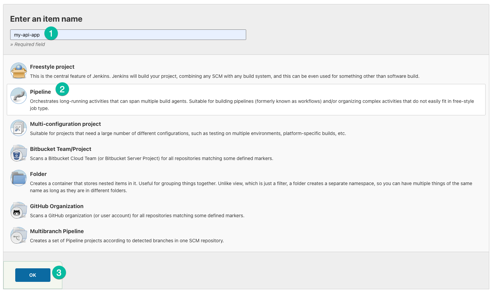
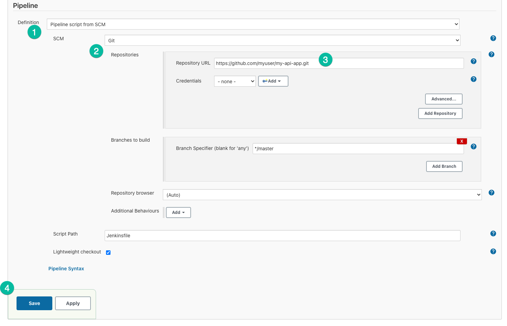
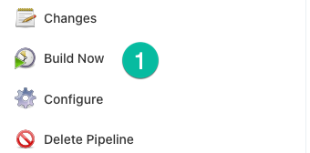
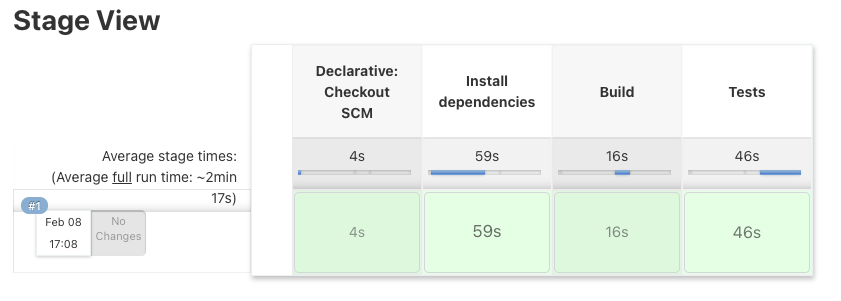
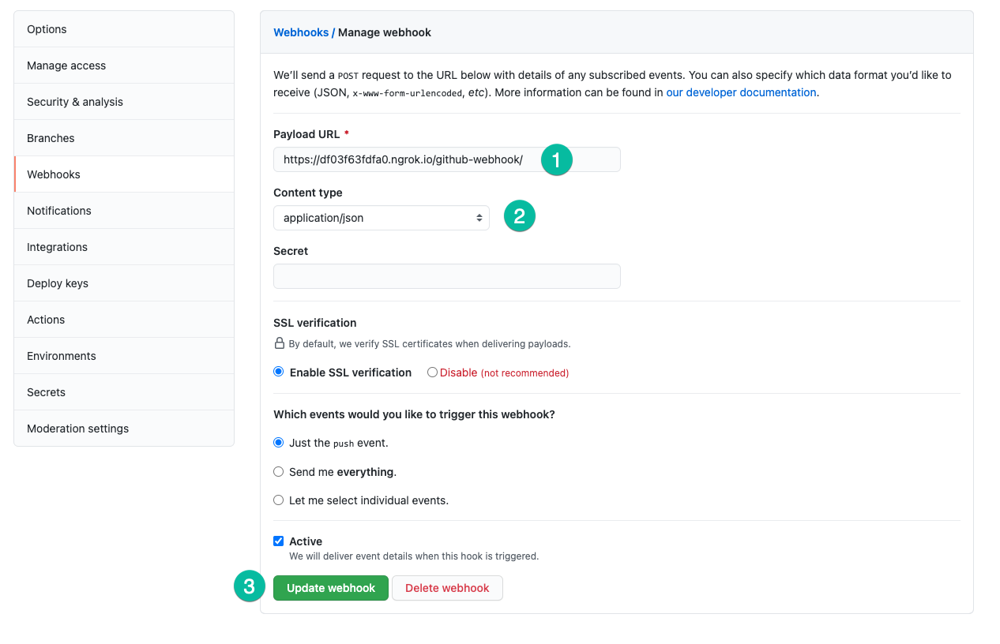
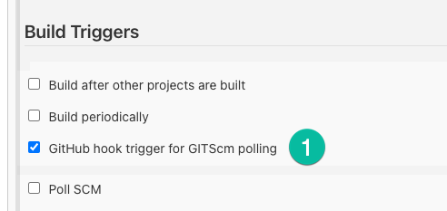

# 01 Jenkins pipeline

In this example we are going to initialize our GitHub repository with the code, dockerize the application and create a Jenkins project to ensure our application compile and tests work. Finally, we'll configure the DockerHub image deployment and GitHub WebHooks in order to avoid manual builds when a changed is made to the repo.

We will start from `00-boilerplate`.

## Prerequisites

You will need:

- A Jenkins instance wich can connect to a Docker daemon and an account with Job and Credentials permissions .
- A DockerHub account.
- A GitHub account with an empty repository to contain the project.
- The tool [ngrok](https://ngrok.com/).

## Steps to build it

### Application containerization

Add `Dockerfile` to containerize the app with next code:\_

```Dockerfile
# Base
FROM node:20-alpine AS base
RUN mkdir -p /usr/src/app
WORKDIR /usr/src/app

# Build app
FROM base AS build-app
RUN mkdir -p /usr/src/build-app
WORKDIR /usr/src/build-app
COPY ./package*.json ./
RUN npm ci
COPY ./ ./
RUN npm run build

# Release
FROM base AS release
COPY --from=build-app /usr/src/build-app/dist ./

COPY ./package*.json ./
RUN npm ci --only=production

ENV NODE_ENV=production

ENTRYPOINT ["node", "./index.js"]
```

Build docker image:

```bash
docker build -t my-api-app .
```

Create container to check if it's working:

```bash
docker container run --name my-api-app --rm --env PORT=3001 -p 3001:3001 my-api-app
```

Open browser and check the API is working: [http://localhost:3001/api/sum?a=3&b=5](http://localhost:3001/api/sum?a=3&b=5).

### Creating Jenkinsfile

Add a `Jenkinsfile` with next content.

```groovy
pipeline {
  agent any
  stages {
    stage('Install dependencies') {
      agent {
        docker {
          image 'node:20-alpine'
          reuseNode true
        }
      }
      steps {
        sh 'npm ci'
      }
    }
    stage('Build') {
      agent {
        docker {
          image 'node:20-alpine'
          reuseNode true
        }
      }
      steps {
        sh 'npm run build'
      }
    }
    stage('Tests') {
      agent {
        docker {
          image 'node:20-alpine'
          reuseNode true
        }
      }
      steps {
        sh 'npm test'
      }
    }
  }
}
```

> IMPORTANT: We need `agent any` on top to have available docker in `Release` step
>
> `reuseNode true` ensures the same workspace is used

To sumarize, we've created two stages to check the app builds and tests pass.

### Adding SCM to the project

In order to upload the code to GitHub we'll initialize a local repository, add a remote repository pointing to our GitHub repo, create our first commit and push the code:

```bash
git init
git remote add origin https://github.com/myuser/my-api-app
git add .
git commit -m "Initial commit"
git push -u origin main
```

### Creating a Jenkins project

Inside our Jenkins let's create a `New Item`


Specify the project name and select Pipeline.



We'll select the Jenkinsfile from SCM pointing to a Git repo with our GitHub repo's URL. We'll specify the `master` branch to build.



Let's build the project to check everything is working.



Our pipeline succeeded.



### Releasing our app to DockerHub

In order to release the image let's first add a Jenkins credentials. Let's navigate through `Manage Jenkins → Manage Credentials → Stores scoped to Jenkins → global → Add Credentials` and add a new `Username with password` credential matching our DockerHub account credentials. We'll asign it as id `dockerhub-credentials`.


In our code we'll modify the `Jenkinsfile` to add a new step that builds and releases the Docker image to Dockerhub.

```diff
  pipeline {
    agent any
+   environment {
+     imageName = 'myuser/my-api-app:latest'
+   }
    stages {
      stage('Install dependencies') {
        agent {
          docker {
            image 'node:20-alpine'
            reuseNode true
          }
        }
        steps {
          sh 'npm ci'
        }
      }
-     stage('Build') {
-       agent {
-         docker {
-           image 'node:20-alpine'
-           reuseNode true
-         }
-       }
-       steps {
-         sh 'npm run build'
-         '''
-       }
-     }
      stage('Tests') {
        agent {
          docker {
            image 'node:20-alpine'
            reuseNode true
          }
        }
        steps {
          sh 'npm test'
        }
      }
+     stage('Build image & push it to DockerHub') {
+       steps {
+         script {
+           def dockerImage = docker.build(imageName)
+           withDockerRegistry([credentialsId: 'dockerhub-credentials', url: '']) {
+             dockerImage.push()
+             sh 'docker rmi $imageName'
+           }
+         }
+       }
+     }
    }
  }
```

Let's commit & push the changes to GitHub and trigger a manual build using the `Build Now` button to check if it works.


## GitHub Webhooks

In order to have automatic builds when some code is being added to the repo we'll configure GitHub Webhooks.

Go to the repo settings, click Webhooks and the `Add webhook` button.


Since we're using our Jenkins instance locally and it is not published to the world we'll use [ngrok](https://ngrok.com/) tool to expose our Jenkins instance. Open a terminal and write:

```bash
ngrok http 8080
```

We'll copy the URL ngrok give us:


We'll use the URL as `Payload URL` and `application/json` as `Content type`.



We'll ensure that GitHub WebHook triggers build by going to the Jenkins project configuration using the `Configure` button and activating the `GitHub hook trigger for GITScm polling`:



Let's trigger the CI build by adding a new commit:

```bash
git commit --allow-empty -m "Trigger CI"
git push
```

We'll see the new build is scheduled and we can see it was GitHub the one that triggered the build.


# About Basefactor + Lemoncode

We are an innovating team of Javascript experts, passionate about turning your ideas into robust products.

[Basefactor, consultancy by Lemoncode](http://www.basefactor.com) provides consultancy and coaching services.

[Lemoncode](http://lemoncode.net/services/en/#en-home) provides training services.

For the LATAM/Spanish audience we are running an Online Front End Master degree, more info: http://lemoncode.net/master-frontend
