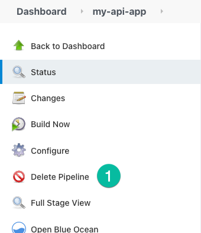
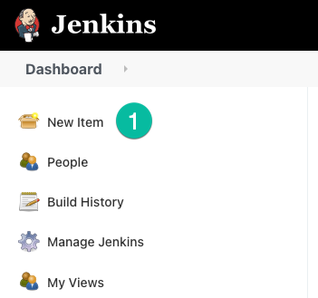
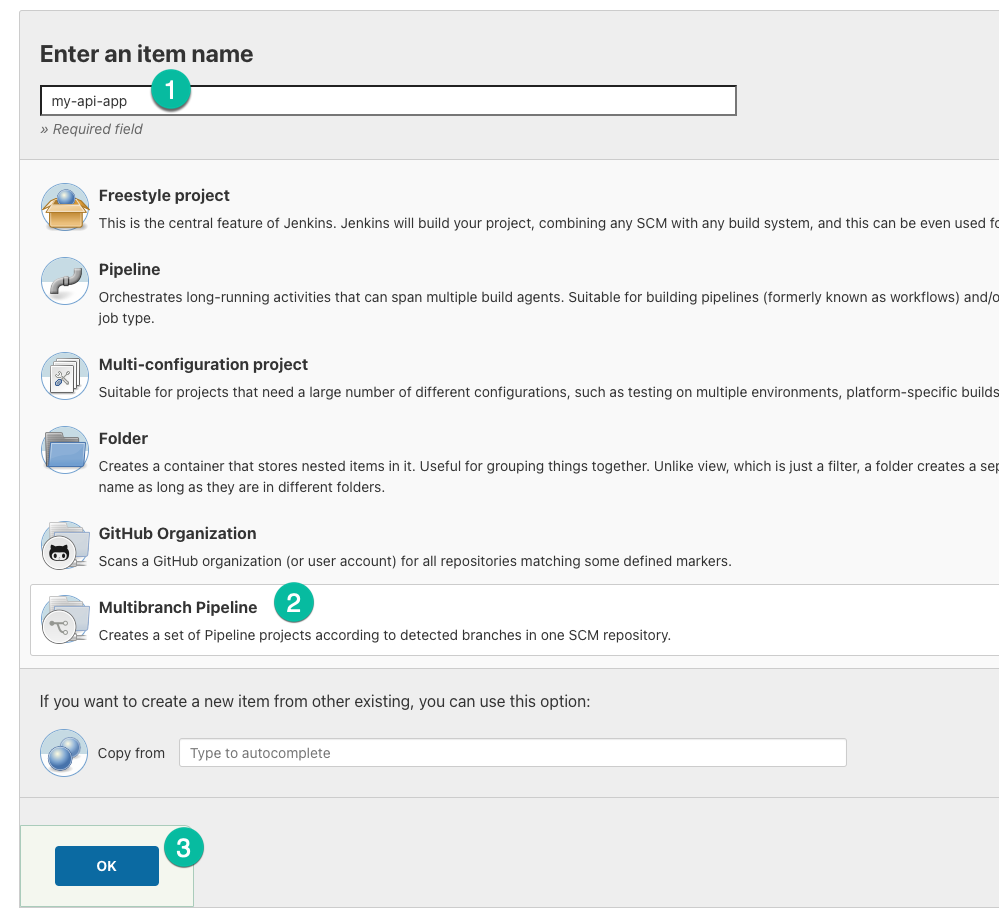
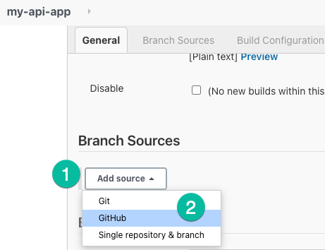
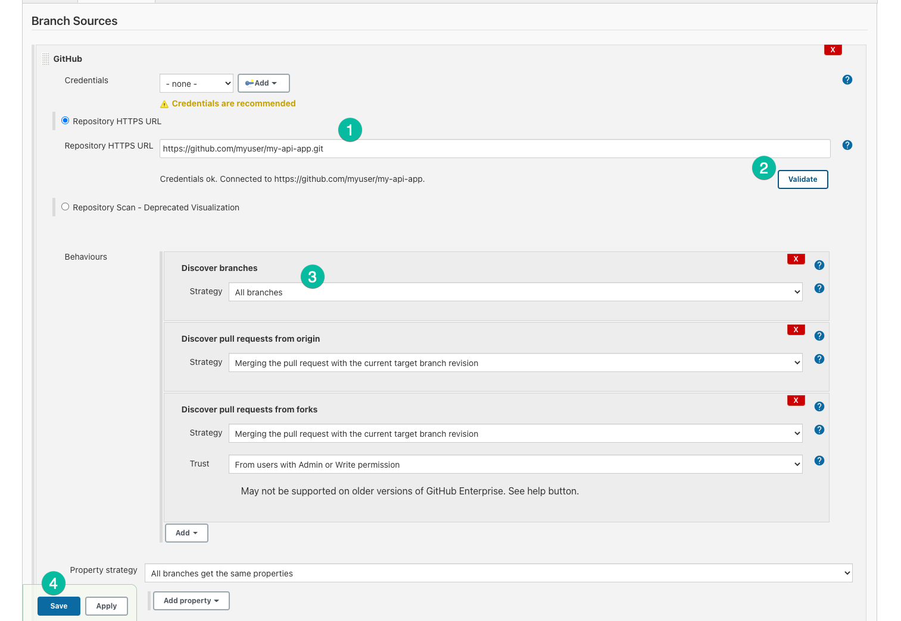
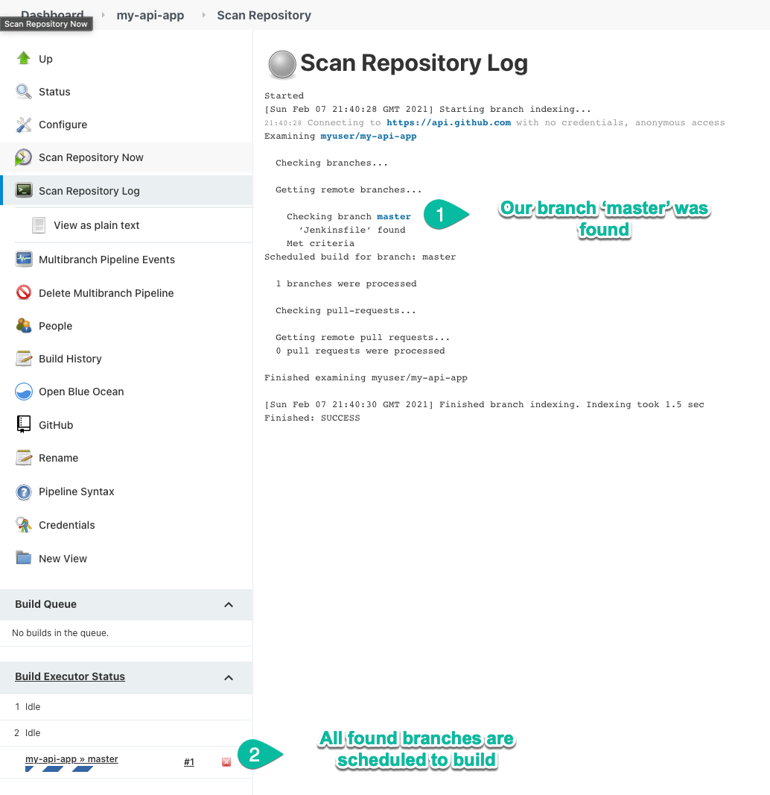
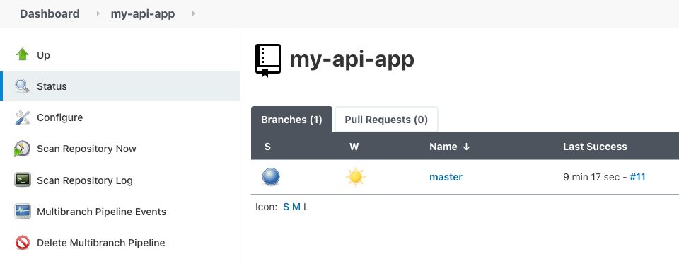

# 02 Jenkins multibranch pipeline

In this example we are going to change our current Jenkins project to be a multi branch pipeline in order to do different actions based on the pushed branch.

We will start from `01-jenkins-pipeline`.

## Prerequisites

You will need the same requirements from `01-jenkins-pipeline`.

## Steps to build it

We'll start by destroying our current Jenkins project by clicking the `Delete project` button.

We'll create a  new project by clicking on`New Item` 

This time we'll select `Multibranch pipeline`.

Add a new branch source and choose GitHub.

We'll add the same repository and chose the discovery type `All branches` 

Well see the Scan Repository running and our `master` branch being build.

Now each branch will have its own folder inside the Jenkins project.

# About Basefactor + Lemoncode

We are an innovating team of Javascript experts, passionate about turning your ideas into robust products.

[Basefactor, consultancy by Lemoncode](http://www.basefactor.com) provides consultancy and coaching services.

[Lemoncode](http://lemoncode.net/services/en/#en-home) provides training services.

For the LATAM/Spanish audience we are running an Online Front End Master degree, more info: http://lemoncode.net/master-frontend
