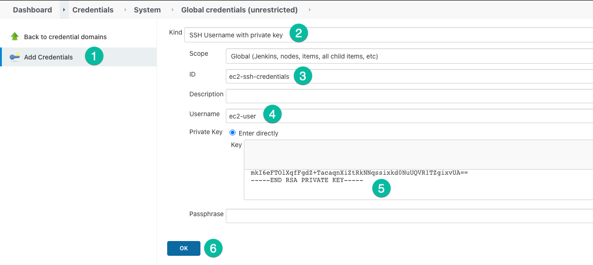

# 03 EC2 deployment

In this example we are going to create a new `develop` branch, restrict some pipeline steps only for that branch and add a new stage to deploy the DockerHub image to an EC2 instance.

We will start from `02-jenkins-multibranch-pipeline`.

## Prerequisites

You will need the same requirements from `02-jenkins-multibranch-pipeline` and an EC2 instance running with:

- An ssh private key to access the EC2 instance.
- Docker installed
- Inbound connections from SSH 22 and HTTP 80.

## Steps to build it

### New branch, new steps

We'll start creating a new `develop` branch starting from `main`.

```bash
git checkout -b develop
```

We'll modify the `Jenkinsfile` to add a `when` condition for our step `Build image & push it to DockerHub` in order to apply this step when branch is `develop`.

```diff
  pipeline {
    agent any
    environment {
      imageName = 'myuser/my-api-app:latest'
    }
    stages {
      stage('Install dependencies') {
        agent {
          docker {
            image 'node:20-alpine'
            reuseNode true
          }
        }
        steps {
          sh 'npm ci'
        }
      }
      stage('Tests') {
        agent {
          docker {
            image 'node:20-alpine'
            reuseNode true
          }
        }
        steps {
          sh 'npm test'
        }
      }
      stage('Build image & push it to DockerHub') {
+       when {
+         branch 'develop'
+       }
        steps {
          script {
            def dockerImage = docker.build(imageName)
            withDockerRegistry([credentialsId: 'dockerhub-credentials', url: '']) {
              dockerImage.push()
              sh 'docker rmi $imageName'
            }
          }
        }
      }
    }
  }
```

Let's create a new bash script that will be run in EC2 instance to deploy the image. We'll place it in `./scripts/deploy.sh`.

```bash
#!/bin/bash

set -e

# Read required variables
readonly imageName="${IMAGE_NAME:?'Missing variable'}"
readonly containerName="${CONTAINER_NAME:?'Missing variable'}"
readonly appPort="${APP_PORT:?'Missing variable'}"

# Stop running container
docker stop $containerName 2>/dev/null || true

# Remove container
docker rm $containerName 2>/dev/null || true

# Remove image
docker rmi $imageName 2>/dev/null || true

# Run container
docker run -d --name $containerName -e PORT=$appPort -p $appPort:$appPort $imageName
```

Now we'll change the `Jenkinsfile` to add this new deployment step.

```diff
  pipeline {
    agent any
    environment {
      imageName = 'myuser/my-api-app:latest'
    }
    stages {
      stage('Install dependencies') {
        agent {
          docker {
            image 'node:20-alpine'
            reuseNode true
          }
        }
        steps {
          sh 'npm ci'
        }
      }
      stage('Tests') {
        agent {
          docker {
            image 'node:20-alpine'
            reuseNode true
          }
        }
        steps {
          sh 'npm test'
        }
      }
      stage('Build image & push it to DockerHub') {
        when {
          branch 'develop'
        }
        steps {
          script {
            def dockerImage = docker.build(imageName)
            withDockerRegistry([credentialsId: 'dockerhub-credentials', url: '']) {
              dockerImage.push()
              sh 'docker rmi $imageName'
            }
          }
        }
      }
+     stage('Deploy to server') {
+       when {
+         branch 'develop'
+       }
+       environment {
+         containerName = 'my-api-app'
+         ec2Instance = 'myec2-instance.compute.awscloud.com'
+         appPort = 80
+       }
+       steps {
+         withCredentials([
+           sshUserPrivateKey(
+             credentialsId: 'ec2-ssh-credentials',
+             keyFileVariable: 'identityFile',
+             passphraseVariable: 'passphrase',
+             usernameVariable: 'user'
+           )
+         ]) {
+           script {
+             sh '''
+               ssh -o StrictHostKeyChecking=no -i $identityFile $user@$ec2Instance \
+               APP_PORT=$appPort CONTAINER_NAME=$containerName IMAGE_NAME=$imageName bash < ./scripts/deploy.sh
+             '''
+           }
+         }
+       }
+     }
    }
  }
```

> We added `StrictHostKeyChecking=no` in order to bypass the initial SSH host verification with `know_hosts` file.

Notice we've introduced a new credential:

- `ec2-ssh-credentials` This is a SSH credentials with private key to allow to connect to the EC2 instance remotely.

Let's create them. Navigate to `Manage Jenkins → Manage Credentials → Stores scoped to Jenkins → global → Add Credentials` and add a new `Secret text` credential.

Then add a new SSH credencials with private key.



Add new changes to repository.

```bash
git add .
git commit -m "Added EC2 deployment"
git push -u origin develop
```

Check the result in Jenkins build. Now we have two branches.


If you go to the Blue Ocean interface and go to develop branch you'll see all steps has been executed.


We can check now in the browser going to the EC2 host the endpoint works.


### Sync up branches

It's time to merge `develop` into `main` to apply the new `Jenkinsfile`.

```bash
git checkout main
git merge develop main
git push
```

Notice now in `main` after the build finish how the steps we allowed to `develop` branch are skip now.


# About Basefactor + Lemoncode

We are an innovating team of Javascript experts, passionate about turning your ideas into robust products.

[Basefactor, consultancy by Lemoncode](http://www.basefactor.com) provides consultancy and coaching services.

[Lemoncode](http://lemoncode.net/services/en/#en-home) provides training services.

For the LATAM/Spanish audience we are running an Online Front End Master degree, more info: http://lemoncode.net/master-frontend
